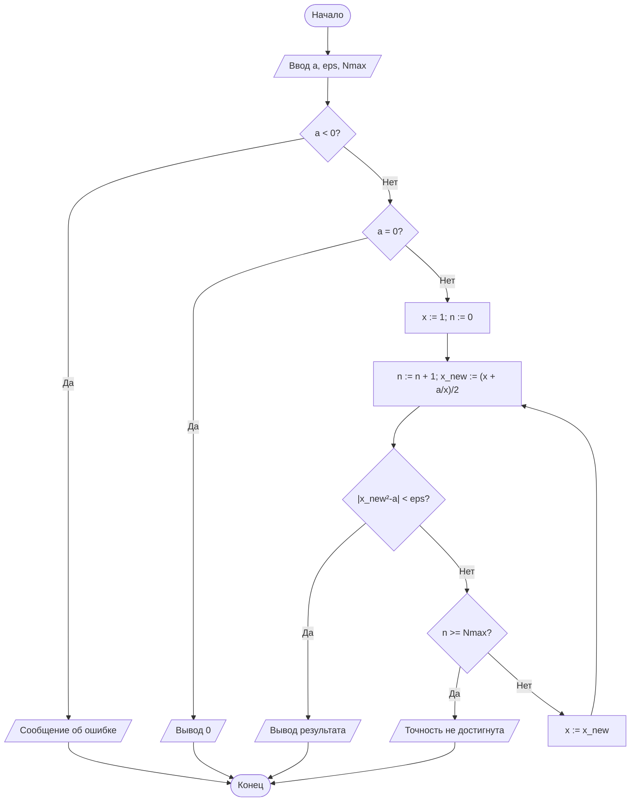
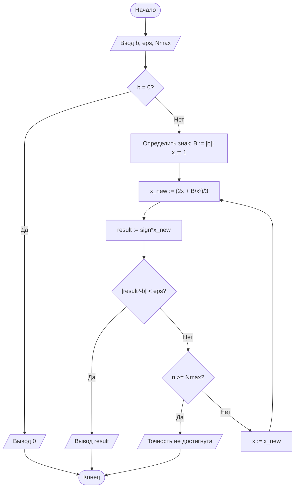
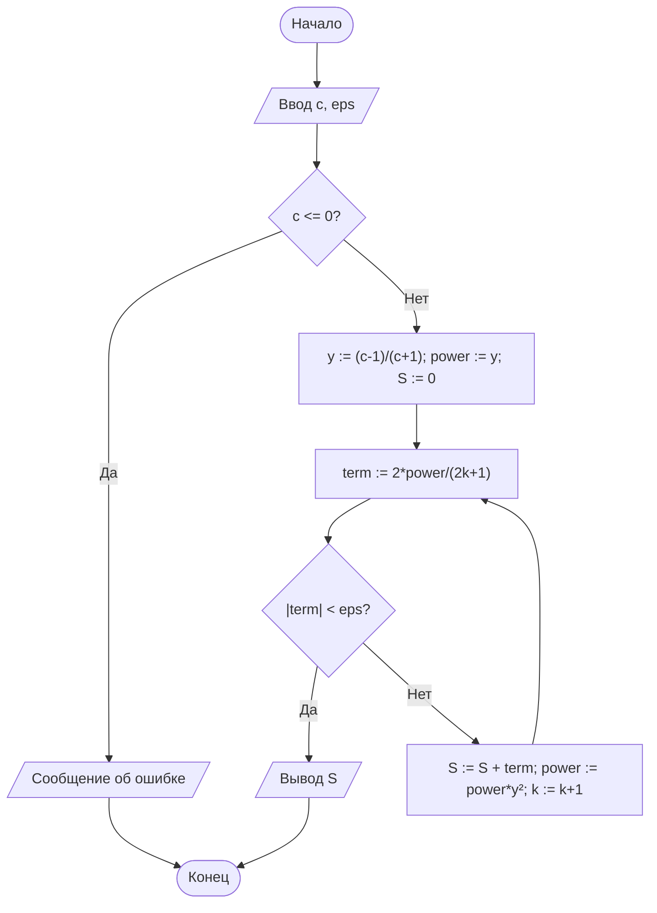

# Лабораторная работа №1

## Итерационные методы вычисления элементарных функций

**Студент:** Осипова Анна  
**Вариант:** 17  
**Дисциплина:** Теория алгоритмов  
**Язык реализации:** Python 3.10+

---

## 1. Цель работы

Изучить итерационные алгоритмы, реализовать метод Ньютона для вычисления квадратного и кубического корней, вычисление натурального логарифма степенным рядом, исследовать критерий остановки и сравнить результаты с эталонными значениями стандартной библиотеки Python.

## 2. Задание варианта 17

| Параметр | Значение |
|---|---:|
| `a` | 0,8 |
| `b` | −216 |
| `c` | 0,05 |
| `eps` | 10^-6 |
| Критерий | по невязке |
| `x0` | 1 |
| Доп. требование | Д6 |

Д6 требует реализовать проверку корректности входных данных (`a < 0`, `c <= 0`, нечисловой ввод) с понятными сообщениями пользователю и продемонстрировать работу проверки.

## 3. Теоретические сведения

Итерационный алгоритм строит последовательность приближений `x0, x1, ...`, где каждое следующее значение вычисляется по предыдущему.

### Квадратный корень

Для уравнения

`F(x) = x^2 - a = 0`

метод Ньютона даёт:

`x_(n+1) = (x_n + a/x_n)/2`.

В варианте 17 используется `x0 = 1`.

Критерий остановки по невязке:

`|x_(n+1)^2 - a| < eps`.

### Кубический корень

Для

`F(x) = x^3 - b = 0`

получаем:

`x_(n+1) = (2x_n + b/x_n^2)/3`.

Для отрицательного `b` сначала вычисляется корень из `|b|`, после чего знак восстанавливается. Для варианта 17 `b = -216`, поэтому результат должен быть равен `-6`.

Критерий:

`|x_(n+1)^3 - b| < eps`.

### Натуральный логарифм

Используется ряд

`ln(c) = 2 * (y + y^3/3 + y^5/5 + ...)`,

где

`y = (c - 1)/(c + 1)`.

Каждый следующий член ряда получается умножением текущей степени на `y^2`. Суммирование прекращается при `|term| < eps`.

Для `c = 0,05` имеем `y ≈ -0,9047619`, поэтому ряд сходится заметно медленнее, чем для аргументов, близких к 1.

## 4. Блок-схемы

### 4.1. Квадратный корень

### 4.2. Кубический корень

### 4.3. Логарифм

## 5. Листинг программы

Основной файл `main.py` содержит три вычислительные функции:

- `sqrt_newton`;
- `cbrt_newton`;
- `ln_series`.

Также реализованы:

- `validate_number()` — проверка числового ввода;
- `demonstrate_invalid_input()` — демонстрация Д6;
- `iterations_table()` — вывод последовательности итераций для контроля процесса.

В вычислительных функциях не используются `math.sqrt()` и `math.log()` для получения результата. Эти функции применяются только для эталонного сравнения.

## 6. Результаты расчётов

Эталонные значения:

- `sqrt(0,8) ≈ 0,8944271909999159`;
- `cbrt(-216) = -6`;
- `ln(0,05) ≈ -2,995732273553991`.

При `eps = 10^-6` получаются следующие результаты:

| Функция | Результат | Эталон | Абсолютная погрешность | Итерации |
|---|---:|---:|---:|---:|
| `sqrt(0,8)` | 0,894427191166 | 0,894427190999 | 1,664·10^-10 | 3 |
| `cbrt(-216)` | -6,000000000048 | -6,000000000000 | 4,754·10^-11 | 11 |
| `ln(0,05)` | -2,995728162550 | -2,995732273554 | 4,112·10^-6 | 50 |

Для логарифма число итераций существенно больше, поскольку `|y| ≈ 0,9048`, то есть отношение соседних степеней близко к 1.

## 7. Демонстрация Д6

Программа обрабатывает следующие ошибочные данные:

| Ввод | Реакция |
|---|---|
| `sqrt(-1)` | сообщение о недопустимом отрицательном подкоренном выражении |
| `ln(0)` | сообщение о недопустимом аргументе логарифма |
| `sqrt("abc")` | сообщение о необходимости ввести число |
| `ln(-5)` | сообщение о необходимости положительного аргумента |

Таким образом, ошибочный ввод не приводит к необработанному исключению: пользователю выводится понятная причина ошибки.

## 8. Анализ результатов

Метод Ньютона для корней быстро переходит в режим квадратичной сходимости. Для `sqrt(0,8)` требуется всего несколько итераций, несмотря на то, что начальное приближение `x0 = 1` не совпадает с корнем.

Для `cbrt(-216)` начальное приближение для модуля равно 1, тогда как искомое значение по модулю равно 6. Поэтому на первых шагах приближение изменяется существенно, а затем быстро стабилизируется.

Вычисление `ln(0,05)` рядом требует намного больше итераций. Причина состоит в том, что `|y|` близко к единице. Это показывает зависимость трудоёмкости ряда от выбранного представления аргумента.

Критерий по невязке непосредственно контролирует соответствие полученного приближения исходному уравнению. При этом малая невязка не всегда тождественна малой абсолютной ошибке результата, поэтому в программе дополнительно выполняется сравнение с эталоном. Для логарифма по условию работы используется критерий по модулю члена ряда.

## 9. Ответы на контрольные вопросы

**1. Что такое итерационный алгоритм?**  
Это алгоритм, в котором решение получается последовательным уточнением приближения по заданной итерационной формуле. Дискретность обеспечивается отдельными шагами, детерминированность — однозначным правилом перехода, массовость — применимостью к допустимому классу входных данных, результативность — критерием остановки и ограничением числа итераций.

**2. Как выводится формула Герона?**  
Для `F(x)=x²-a` имеем `F'(x)=2x`. Подстановка в формулу Ньютона `x_(n+1)=x_n-F(x_n)/F'(x_n)` даёт:
`x_(n+1)=x_n-(x_n²-a)/(2x_n)=(x_n+a/x_n)/2`.

**3. Чем отличаются критерии по разности и по невязке?**  
Критерий по разности проверяет изменение двух соседних приближений: `|x_(n+1)-x_n|<eps`. Критерий по невязке проверяет, насколько хорошо текущее приближение удовлетворяет исходному уравнению. Они могут остановить алгоритм на разных шагах.

**4. Что такое порядок сходимости?**  
Если ошибка примерно удовлетворяет `e_(n+1) ≈ C e_n^p`, то `p` называют порядком сходимости. У метода Ньютона при выполнении стандартных условий `p≈2`, поэтому после попадания в окрестность корня точность растёт очень быстро.

**5. Как влияет начальное приближение?**  
Начальное значение влияет на число итераций и поведение первых шагов. В варианте 17 используется `x0=1`; для кубического корня нужно прийти от 1 к 6 по модулю, поэтому требуется больше шагов, чем для квадратного корня из 0,8.

**6. Почему ряд `ln(1+x)` неудобен для больших аргументов?**  
Он имеет область сходимости, ограниченную условием `-1 < x <= 1`. Поэтому непосредственная подстановка большого аргумента невозможна. Преобразование с `y=(c-1)/(c+1)` даёт `|y|<1` для любого `c>0`.

**7. Зачем нужна нормализация `c=m*2^k`?**  
Она позволяет заменить исходный аргумент на число `m`, для которого ряд сходится быстрее, а затем добавить `k ln 2`.

**8. Почему фактическая погрешность может быть меньше `eps`?**  
Критерий остановки является достаточным условием завершения, а не точной оценкой абсолютной ошибки. После выполнения условия следующий результат может оказаться значительно точнее заданного порога.

**9. Зачем нужен `Nmax`?**  
Это защита от бесконечного цикла при плохих входных данных, неудачной формуле или невозможности достичь заданной точности из-за ограничений вычислений.

**10. Пример итерационной задачи в бизнесе.**  
Внутренняя норма доходности (IRR) определяется как ставка, при которой чистая приведённая стоимость денежного потока равна нулю. Это нелинейное уравнение можно решать итерационными методами.

## 10. Вывод

В ходе работы были реализованы итерационные алгоритмы вычисления квадратного и кубического корней методом Ньютона и натурального логарифма с помощью степенного ряда. Для варианта 17 использованы критерий остановки по невязке для корней и начальное приближение `x0=1`. Дополнительное требование Д6 выполнено: реализована проверка отрицательных и нулевых недопустимых аргументов, а также нечислового ввода. Эксперимент показал, что метод Ньютона достигает требуемой невязки за небольшое число итераций, тогда как ряд для `ln(0,05)` сходится существенно медленнее. Также обнаружено, что заданный методичкой критерий остановки ряда по модулю одного члена не гарантирует абсолютную погрешность суммы меньше `eps`.
